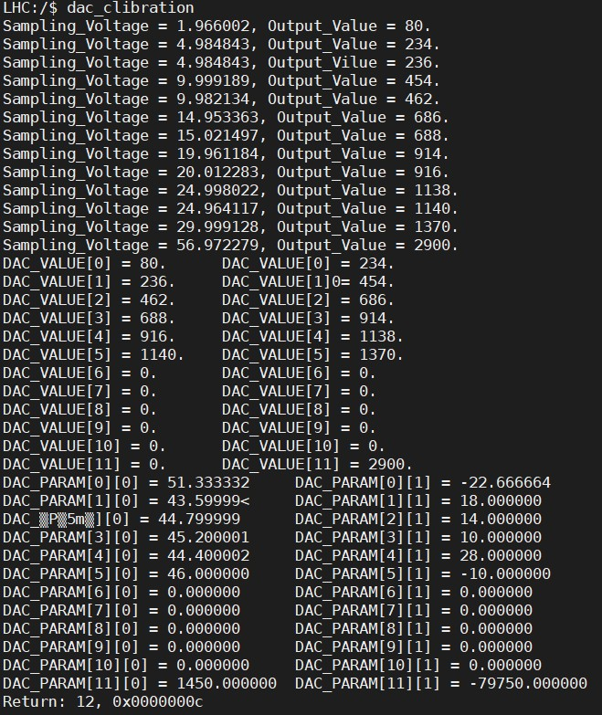

# ValveHoll

- [ValveHoll](#valveholl)
	- [简介](#简介)
	- [功能](#功能)
	- [使用方式](#使用方式)
	- [关键点](#关键点)
	- [测试项目](#测试项目)
	- [函数说明](#函数说明)
	- [存在问题](#存在问题)
			- [2022/03/05 补充](#20220305-补充)
	- [二次开盖后操作](#二次开盖后操作)
	- [迪文屏幕说明](#迪文屏幕说明)
		- [更新前](#更新前)
		- [更新后](#更新后)

## 简介

阀厅充电器是一个2-54V/62.5A自适应蓄电池充电器，主要适用充电对象是以单体 **2V** 的整数倍蓄电池。

## 功能

输出电压：2-54V，输出最大电流：62.5A,总功率：3000W。

## 使用方式

- 接入220-240v交流电。
- 进入后台设置当前电池容量。(必须)
- 接入电池，在未指定单体电池个数时，充电参数将会自动获取，并自动开始充电和停止。

## 关键点

- 硬件部分：
	- 底部电源型号：明纬RSP-3000-SPEC-CN3000W。
	- 电源使用自定义方式时，底部限压电位器应该调节到最大，DAC满载时输出电压在57V左右。
	- 主控芯片为 **STM32F103VCT6**,Flash：256KB(2K/页)，SRAM：48KB，怀疑此芯片为盗版芯片，后256KB空间可以无措访问。(2022/3/5：芯片非盗版，而是ST公司为了提高产品的良率，超256KB以后的FLASH空间可能存在坏块)
	- 特别注意：底板电源自定义模式时，主板与底板间两组控制线切记要接牢固，否则可能底板电源将会 **烧毁报错**。(由绿灯变红灯)
	- 底板输出大电流时特别需要注意 **散热问题**，散热不好将会烧机子。

- 软件部分：
	- 上电初始化时，如果通过 **STM32CubeMX** 更改过硬件配置，则需要注意把 **MX_IWDG_Init();** 放在 **HAL_Delay(3000)** 后，否则看门狗将会导致芯片复位。
	- **HAL_Delay(3000)** 是为了解决初始上电时芯片串口DMA工作不正常导致的后台参数错乱问题。
	- 目前看门狗溢出时间为：1.6s（喂在10ms定时器 **1** 中进行）。
	- 充电参数保存地址为：**STM32FLASH_BASE + 254U * FLASH_PAGE_SIZE**。
	- 充电器DAC校准参数保存地址为：**STM32FLASH_BASE + 255U * FLASH_PAGE_SIZE**。
	- Flash存取按 **unsigned 16bit** 进行， 数据读取为满足多种数据类型，按 **unsigned 8bit** 进行读取，其他类型读取将会导致内核错误，MCU卡死。
	- 充电流程说明：
		- 在没有电池接入时，充电器默认处于待机状态，充电状态图标不点亮（红色）。
		- 接入电池后，充电在自动模式下通过检测电池电压，自动获取充电参数，开始充电。
		- 动作次序：底板电源先打开，2s后才会启动直流接触器对外输出电压。
		- 最高权限： **交流输入** 开关，此开关打开，充电器底板供电将会被切断。
		- 次高级权限：**充电时间**，此值将会决定充电器指定充电时间。充电时间与此值相等时，充电器将会强制停止工作。
		- 低级权限：在恒压阶段，充电电流在30分钟内基本没有变化，认定的充电结束。
	- 充电结束后，如果电池未被拔掉，电池默认要降低到一定电压才会二次起充。
	- 如果是由于 **关闭交流接触器** 或者其他原因导致的认定为充电结束，则核心板风扇将不会停转。
	- 涓流和恒流阶段电流调节机制：
		- 根据目标电流的倍率，在一个允许的正负范围内调节。
	- DAC校准机制：
		- 精准参考源：ADC采集的电压通道。
		- 起始输出电压2V，终止电压57V，中间每次增加5V，总共分为12段。
		- 校准通过从0加到目标电压值时DAC值（每次增加1V），记录每个点电压值和DA值。
		- 通过一元一次方程解出各段系数P1、P2存储到内部FLash中。
		- **while ((Temp_Voltage < HARDWARE_DAVOLTAGE) && (Dac.Finish_Flag))** 中 **Dac.Finish_Flag** 在
		**Dac_Clibration()** 执行后 **Dac.Finish_Flag == false** , 导致该段校验程序失效。

	

## 测试项目

- 电压、电流的ADC校准与测试。
- 输出电压（0-5V）通过STM32内部DAC调节校准与测试。(自动校准)
- Flash参数掉电保存测试。
- 接入电池时继电器动作顺序。
- 迪文屏幕后台参数设置有效性。
- 充电模式下，交流、快充打开、关闭，充电时间校验。
- 电压调节导致的电流波动性。
- 恒流阶段大电流输出稳定性。
- 恒压阶段，充电自动停止测试。
- 二次起充测试。

## 函数说明

- 暂略。

## 存在问题

- 屏幕后台设置中部分关键充电参数对用户开放，安全系数较低。
- 迪文屏幕通信未加入CRC校验。
- 充电控制流程繁琐、变量众多。
- 关键系统参数并未存入一次性设置后背寄存器，每次使用串口下载，导致重复校准，浪费时间。
- 后期维护成本高。

#### 2022/03/05 补充
- ①零电流开路，导致的频繁跳动，不报故障
- ②电池采样电压、电流波动
- ③内部通过次数计时<<目标时间
- ④容量上限设置无效时显示上下限
- ⑤校准系数在每次擦除程序后丢失（改用其他串口烧录软件，更新程序时不擦除特定参数区）
- ⑥迪文屏幕对电池容量、电池单元数上下限、充电时间上限未作出限制（2022/05/03改进）
- ⑦恒压、恒流区分不明显，充电结束条件不规范

## 二次开盖后操作
- 屏幕程序更新(2022/3/5更新)
- MCU程序更新（未执行）

## 迪文屏幕说明
- 屏幕型号：``DMG80480C043_01WTC``
- 迪文屏工程名字：``FATING-2``
- 工程路径：``G:\DGUS_WorkSpace\FATING-2``
- 迪文开发软件：T5L(老版本)和新版本（未投入市面使用）
- 屏幕工程采用新版本编译，老版本编译导致屏幕后台参数界面字体错位。

### 更新前
- 后台界面参数设置未做上下限限定
- 重要参数：单元个数、启动电压、电池容量、补偿电压

### 更新后
- 三个阶段充电电压、电流均不可设置（仅仅可改变为0：迪文屏幕BUG）
- 单元个数数据录入范围：0-24
- 启动电压数据录入范围：0-99V(迪文屏幕BUG，数据限定后，输入输入12，显示仅仅只有1.2)
- 电池容量数据录入范围：10-500Ah
- 补偿电压数据录入范围：100-500mV（首次起充补偿电压值，越大电流产生的越快）